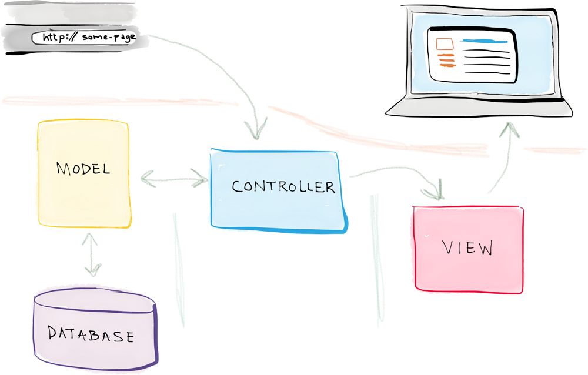

class: center, middle, inverse, small-images

# React
## Declaring UI instead of handling every state change manually


##### 17 Feb 2021

---
class: inverse

# Will this be a boring workshop?

### No.

.highlight[Please feel free to interrupt and ask questions, make this more of a conversation and less of a lecture.]

What we have on menu today:
1. What is React exactly
1. React Theory
1. Common libraries that go well together with React
1. React in practice

---
class: inverse

# Your Host

<div class="left" style="display: flex; align-items: center; gap: 1em">
<div></div>
<div>
    <p class="highlight">Angelo Teixeira</p>
    <p>MIEIC Finalist</p>
    <p>2+ Years experience with React - Including internships and NIJobs</p>
</div>
</div>

<!-- Use this if you have more presenters -->
<!-- <div class="right" style="display: flex; align-items: center; gap: 1em;justify-content: flex-end">
<div>
    <p class="highlight">Second Host</p>
</div>
<div></div> -->

</div>


---
class: center, middle, inverse

# React
## What is it, really?

---

# React

.highlight[React] is a .highlight[JavaScript] library that automatically renders and handles component updates on a `<div>` of your website 

.center[
```javascript
ReactDOM.render(
    <App />,
    document.getElementById("root")
);
```
]

---

# React

This allows it to run .highlight[wherever] inside an existing website. You can even migrate progressively from old UIs to React-powered UI components. 

React is just glorified JavaScript. Always keep this in mind! To use it, you just need to load it in a `script` tag in your HTML, then you can use all of its functionalities.

---

# React in an HTML page

.center[
```html
<html lang="en">
    <head>
        <meta charset="utf-8">
        <title>NIJobs</title>
        <link href="https://ni.fe.up.pt/st4g1ng/nijobs/static/css/main.4f9a2d8f.chunk.css" rel="stylesheet">
    </head>
    <body>
        <noscript>You need to enable JavaScript to run this app.</noscript>
        <div id="root"></div>

        <!-- React source code -->
        <script src="https://ni.fe.up.pt/st4g1ng/nijobs/static/js/2.8ac0d13b.chunk.js"></script>
        <!-- Application source code, using React -->
        <script src="https://ni.fe.up.pt/st4g1ng/nijobs/static/js/main.df8d00d7.chunk.js"></script>
    </body>
</html>
```
]

---

# React vs JavaScript

React .highlight[**is**] JavaScript. Most of the problems you'll face are just JavaScript problems.

In fact, React was really good in the sense that it made me learn a lot of JavaScript theory.

---

# React is only the View

<!-- In a typical web application, you have 3 layers: -->

* .highlight[**Data Layer**] - Stores the data of the application (Users, posts, comments, etc...)
* .highlight[**Logical Layer**] - Manages the interactions between the View Layer and the Data Layer (An HTTP API for example)
* .highlight[**View Layer**] - The page that is visible to users and with which they can interact

###### React is designed to only be used in the .highlight[**View Layer**].

.height-limit-250[]

---
class: middle

# Declaratve vs Imperative Paradigms


In .highlight[Imperative] programming, you define exactly what will be done and .highlight[how].

In .highlight[Declarative] programming, you define what happens depending on some state.

---

# Imperative Programming

.center[
```javascript
function markSelected(id) {
    const item = document.getElementById(id);
    item.classList.add("selected");
}

Array.from(document.getElementsByClassName("todo-item"))
    .forEach(elem => elem.addEventListener("click", markSelected(elem.id)))

```
]

---

# Declarative Programming (in React)

.center[
```javascript

const [items, setItems] = useState([{isSelected: false, text: "TODO1"}])

const toggleItemSelection = (i) => {
    setItems((items) => {
        const updatedItems = cloneDeep(items);
        updatedItems[i].isSelected = !items[i].isSelected
        return updatedItems
    });
}

items.map((item, i) => (
    <p 
        className={item.isSelected && "selected"}
        onClick={toggleItemSelection(i)}
    >
        {item.text}
    </p>
))
```
]

---

# Comparison

Declarative has a big advantage since it releases you from needing to think how things interact with each other every time.

If you ever wanted to add a "how many are selected" counter in the previous example, in the imperative version, you needed to add a new listener or change the current one. In the declarative version, you just need a new component that counts the items which have `isSelected: true`, since that is already done in the onClick definition of the item.

Think about the state and how it changes, not how the components change. The components will change according to the current state automatically*.

##### * Of course you still need to link the state to the component in some way for it to know about it, like we do by using the `isSelected` variable

---

# Context Sum up

* React is not a website maker.
* There are no "React websites". There are websites that *use* React.
* This is why React is a library and not a framework.
* React uses declarative programming to design the interface components, making them rely on a state, instead of requiring you to specify exactly how they should modify themselves. React handles the DOM changes for you :)

---

class: center, middle, inverse

# React Theory

## Now it will start to make sense, I hope

---

# JSX

React uses an HTML-in-JS language (JSX) that lets you specify the components similarly to how you would do it in regular HTML. There are some differences like using `className` instead of `class`, and allowing you to have JavaScript sections to generate some parts of it

.center[
```html
<div className="meteorolgy-widget">
<p>{"This is Javascript. " + "Today it's " + getMeteoPrediction()}</p>
{
    weeklyPredictions.map(prediction => (
        <p>{prediction.day + " - " + prediction.state}</p>
    ))
}
</div>
```
]

---

# Components

React is based on a tree of components it will recursively render. A component can render none or multiple children, which will be other components, which will be rendered themselves, and so on.

It is generally a good practice to create small and simple components and leave each component responsible for the minimum logic possible.

.center[
```javascript
const NewsWebpage = ({news, ads}) => (
    <> // Special "dummy" component - React.Fragment
        <NewsArea news={news}/>
        <AdsColumn ads={ads}>
    </>
)
```
]

---

# Components - Props

In order to change dynamically, Components can receive a `props` object to use when creating the rendering logic.

Components always have a `children` prop representing their children components.

---
# Components - Props


.center.dense-wide[
```html
const WrapperThatAddsAnHelloV1 = (props) => (
    <>
        <p>Hello,</p>
        <p>{props.name}</p>
    </>
)

const WrapperThatAddsAnHelloV2 = (props) => (
    <>
        <p>Hello,</p>
        {props.children}
    </>
)

const MyPage = () => (
    <>
        <WrapperThatAddsAnHelloV1 name="World"/>
        <WrapperThatAddsAnHelloV2>
            <p>World</p>
        </WrapperThatAddsAnHelloV2>
    </>
)
```
]